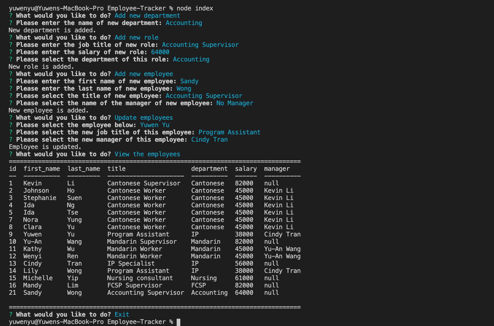

# Employee-Tracker

## Task

The purpose of this assignment is to create a content management system which is specially for employers to view and interact with the information of their employees. This system is a command-line application and mySQL is used in this application to handle with the data of employees.

## Technologies Used

* JavaScript
* Node.js
* Inquirer - npm
* mysql - npm
* console.table - npm

## Functionality and Appearance

The functions of this application will allow employers to:

* Add departments, roles, employees
* View departments, roles, employees
* Update employee roles
* Update employee managers
* View employees by manager
* Delete departments, roles, and employees
* View the combined salaries of all employees in that department

Below shows the appearance of this application:

Here is the video of demo for functionality: [video demo](https://drive.google.com/file/d/1Q7L61-lbrFUufm_xD7kGGRPMl8DYJY2N/view)

<!-- ## Installation

1. Git clone the application to your local directory;
2. input '**npm i inquirer**' to install inquirer package;
3. input '**npm i mysql**' to install mysql package;
4. input '**npm i console.table --save**' to install console.table package; -->

## URL Sources

Feel free to check the application repository: [https://github.com/ywen26/Employee-Tracker](https://github.com/ywen26/Employee-Tracker)

If you have any questions and ideas about this application, contact me at: <yensonyu@gmail.com>

## License

MIT License

Copyright (c) [2020] [Ywuen Yu]

Permission is hereby granted, free of charge, to any person obtaining a copy of this software and associated documentation files (the "Software"), to deal in the Software without restriction, including without limitation the rights to use, copy, modify, merge, publish, distribute, sublicense, and/or sell copies of the Software, and to permit persons to whom the Software is furnished to do so, subject to the following conditions:

The above copyright notice and this permission notice shall be included in all copies or substantial portions of the Software.

THE SOFTWARE IS PROVIDED "AS IS", WITHOUT WARRANTY OF ANY KIND, EXPRESS OR IMPLIED, INCLUDING BUT NOT LIMITED TO THE WARRANTIES OF MERCHANTABILITY, FITNESS FOR A PARTICULAR PURPOSE AND NONINFRINGEMENT. IN NO EVENT SHALL THE AUTHORS OR COPYRIGHT HOLDERS BE LIABLE FOR ANY CLAIM, DAMAGES OR OTHER LIABILITY, WHETHER IN AN ACTION OF CONTRACT, TORT OR OTHERWISE, ARISING FROM, OUT OF OR IN CONNECTION WITH THE SOFTWARE OR THE USE OR OTHER DEALINGS IN THE SOFTWARE.